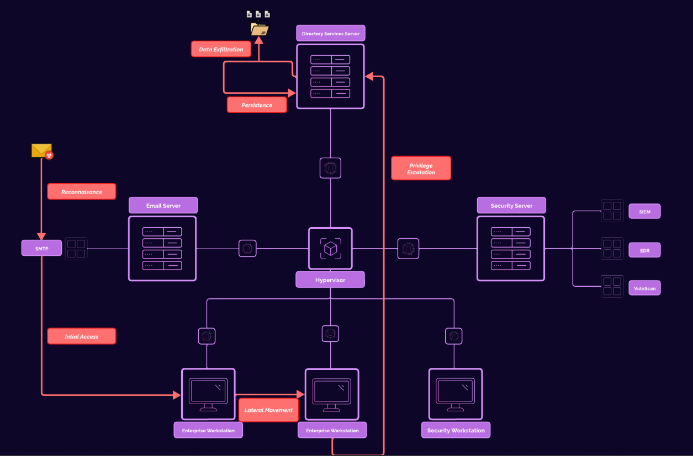
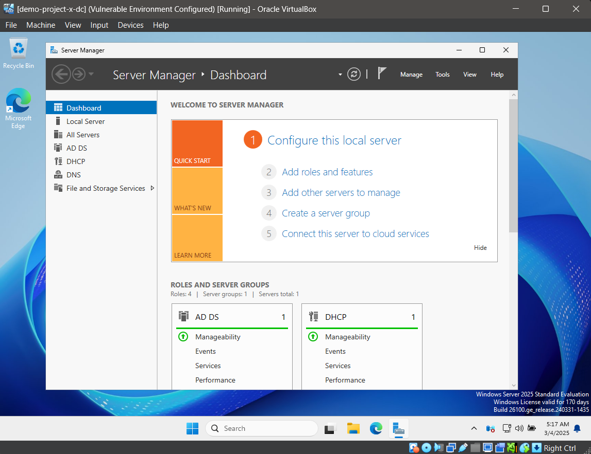
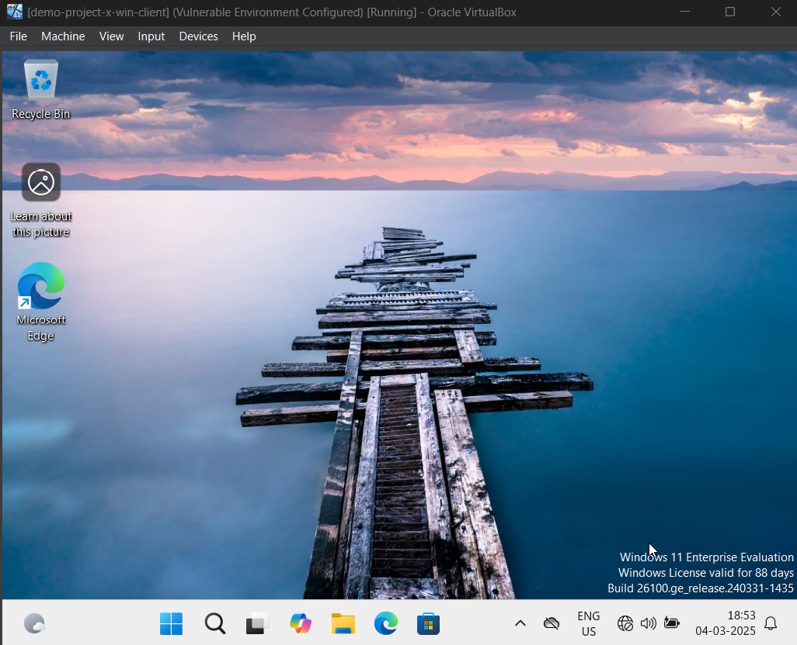
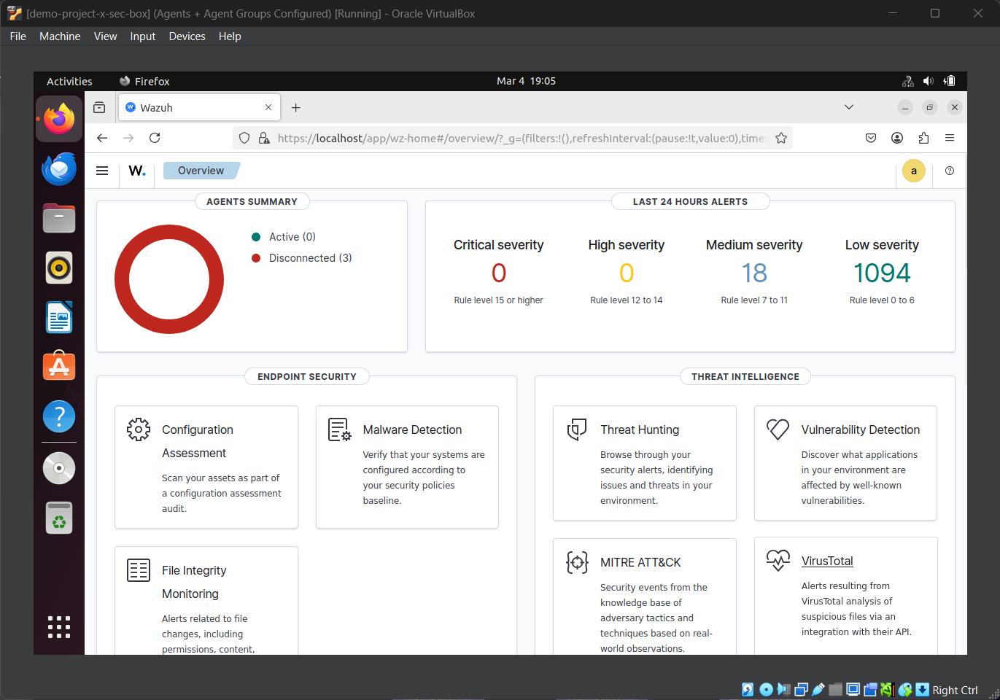
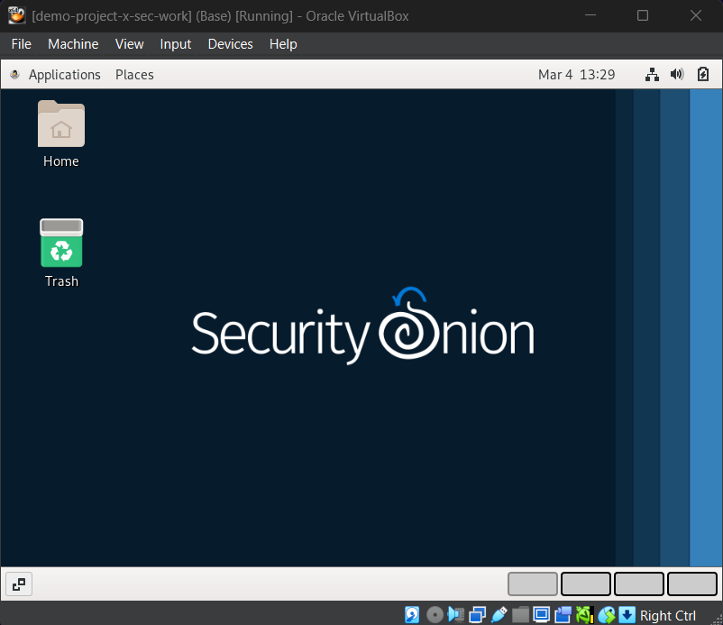
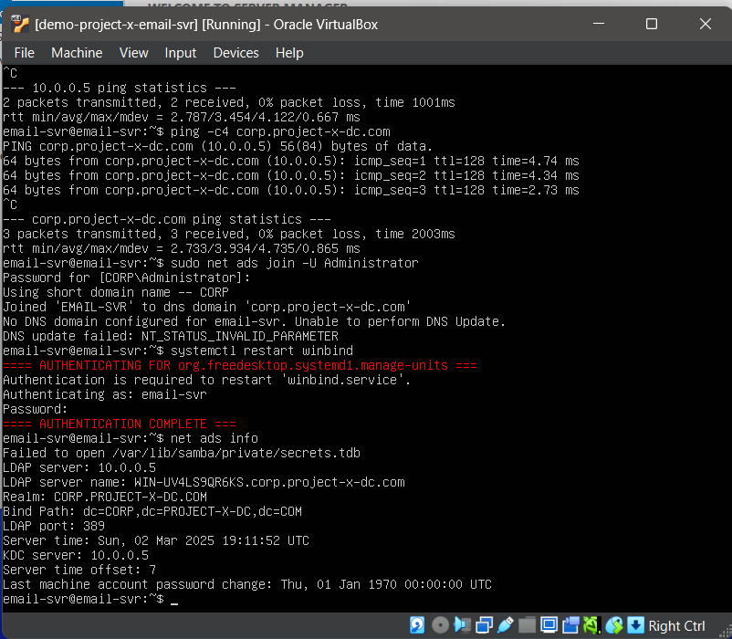
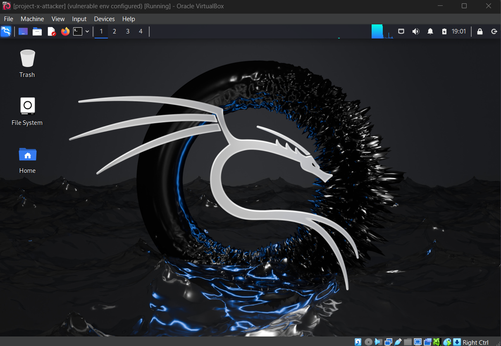

# Home Lab Setup

## 🔥 Attack Simulation Diagram

## 🖥️ Domain Controller Overview
- **Hostname:** `dc (corp.project-x-dc.com)`
- **IP Address:** `10.0.0.5`
- **Function:** Domain Controller (DNS, DHCP, SSO)
- **Administrator Password:** `@Deeboodah1!`

## 🛠️ Workstations & Servers

### 🖥️ Windows Client
- **IP Address:** `10.0.0.100` (or dynamic)
- **Function:** Windows Workstation
- **User Credentials:**  
  - `johnd@corp.project-x-dc.com / @password123!`

### 🐧 Linux Client
- **IP Address:** `10.0.0.101` (or dynamic)
- **Function:** Linux Desktop Workstation
- **User Credentials:**  
  - `janed@linux-client / @password123!`

### 🔐 Security Server
- **Hostname:** `sec-box`
- **IP Address:** `10.0.0.10`
- **Function:** Dedicated Security Server (Monitoring, Detection)
- **User Credentials:**  
  - `sec-work@sec-box / @password123!`

### 🛡️ Security Playground
- **Hostname:** `sec-work`
- **IP Address:** `10.0.0.103` (or dynamic)
- **Function:** Security Testing & Simulation
- **User Credentials:**  
  - `project-x-sec-work / @password123!`

### 📧 Email Server
- **Hostname:** `email-svr`
- **IP Address:** `10.0.0.8`
- **Function:** SMTP Relay Server
- **User Credentials:**  
  - `email-svr@project-x-email-svr / @password123!`

### 🕵️ Attacker Machine
- **IP Address:** `10.0.0.50`
- **Function:** Attacker Environment
- **User Credentials:**  
  - `attacker@attacker / attacker`

## 🎖️ Credits
This project is inspired by **ProjectSecurity**, and special thanks to **Grant Collins** for providing an incredible learning experience and guidance through this project setup.

